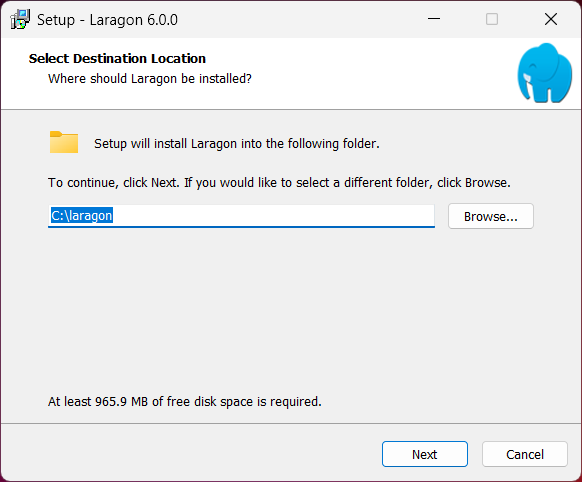
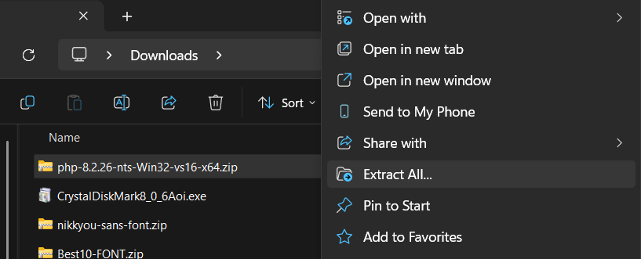
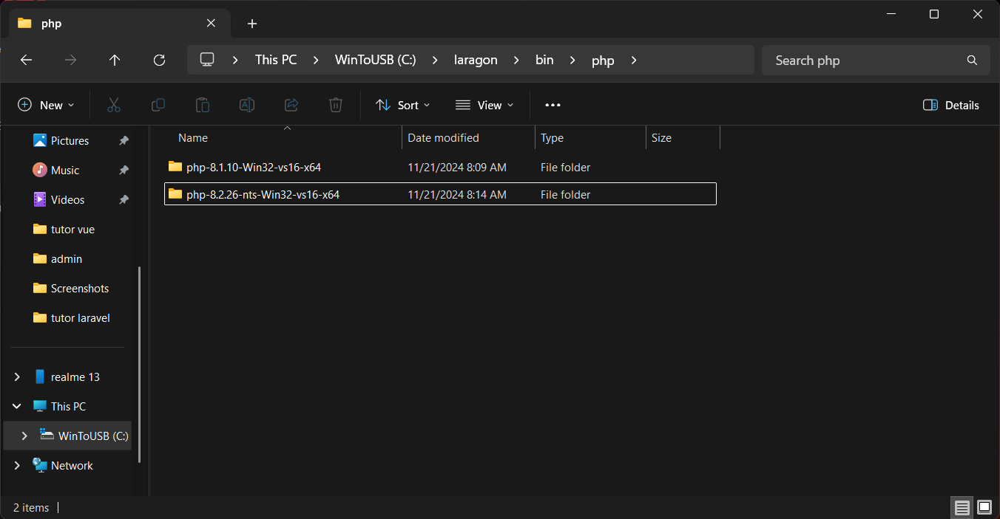
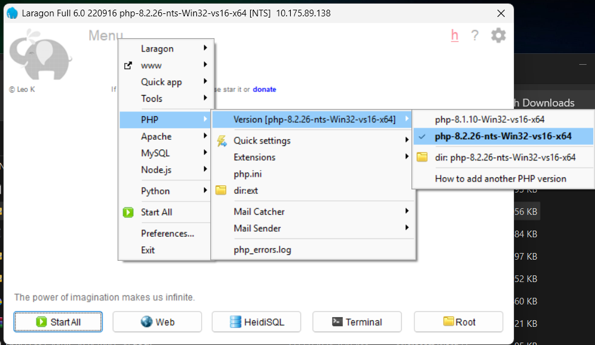
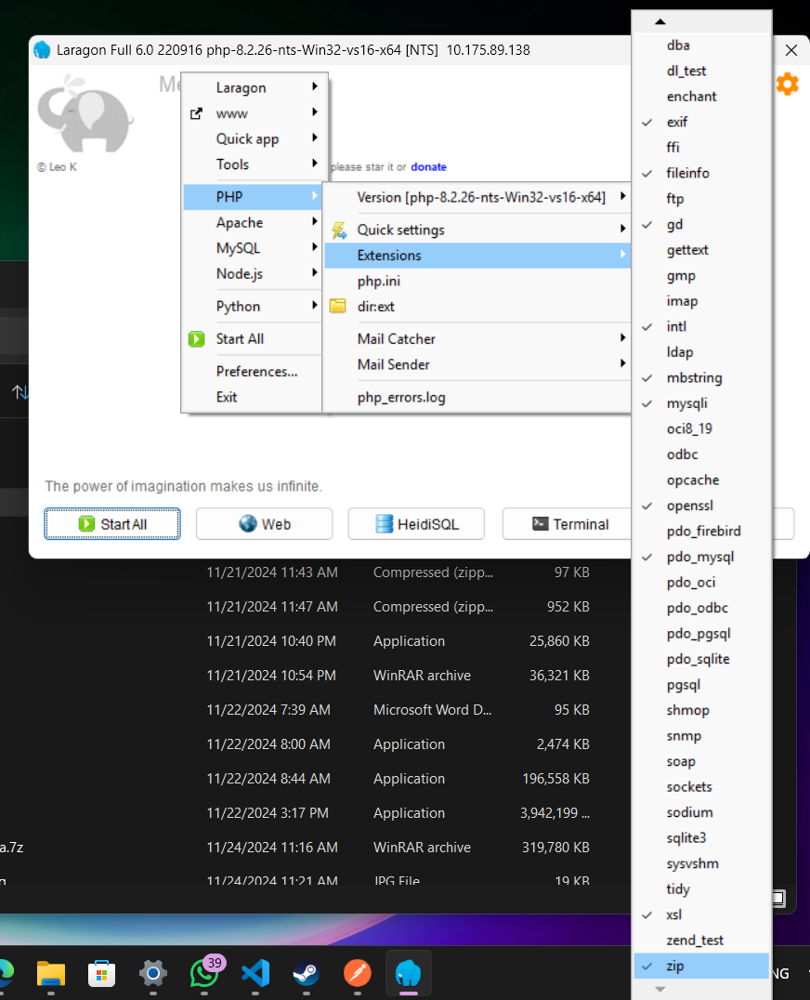
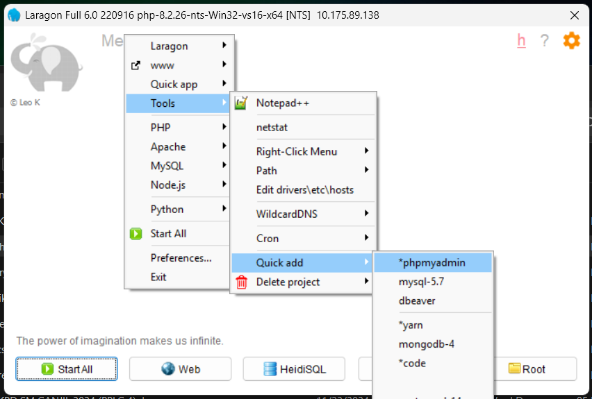
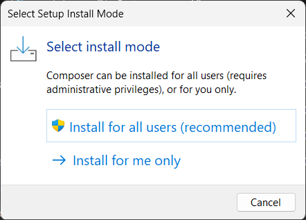
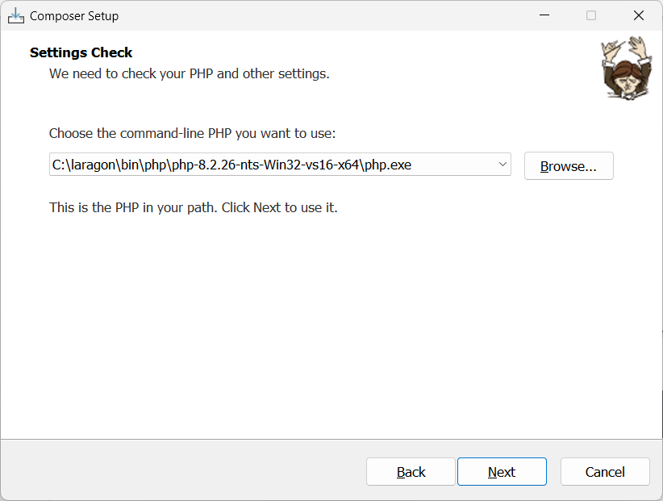

id: instalasi-environment-laravel
summary: Panduan instalasi environment Laravel dengan Laragon, Composer, dan Git.
categories: laravel, php, backend
status: Published
authors: Ramdani
Feedback Link: https://github.com/username/repo/issues

# Instalasi Environment Laravel

## Step 1 — Mendownload Aplikasi

Download semua aplikasi yang ada di [list aplikasi yang dibutuhkan](https://ram2thedani.github.io/modul/restapi-laravel-part1/#1).

---

## Step 2 — Menginstall Laragon

1. Setelah Laragon berhasil didownload, **double klik** file `laragon-wamp.exe` kemudian pilih _English_ untuk bahasanya.
2. Jika muncul pop-up seperti berikut:<br>
   <br>
   Klik **Next/Install** sampai muncul proses install.
3. Tunggu sampai proses install selesai.
4. Setelah proses install selesai, download **PHP 8.2**, lalu extract.<br>
   <br>
5. Copy folder hasil extract PHP ke `C:\Laragon\bin\php`, lalu paste di sana.<br>
   

---

## Step 3 — Setting Laragon

1. Jalankan Laragon kemudian klik **Menu > PHP > Version**, pilih versi **8.2**.  
    <br>
   <br>
2. Aktifkan ekstensi **zip** dengan cara klik **Menu > PHP > Extension > zip**.  
    <br>
   <br>
3. Install **phpMyAdmin** dengan cara klik **Menu > Tools > Quick Add > phpMyAdmin**, kemudian tunggu sampai selesai.  
    <br>
   <br>

---

## Step 4 — Menginstall Composer

1. Setelah Composer berhasil didownload, **double klik** pada file `composer-setup.exe`, klik **Install for all users (recommended)**.  
    <br>
   <br>
2. Jika muncul pertanyaan tentang _developer mode_, silakan klik **Next** saja (tidak mencentang opsi apapun).
3. Di bagian PHP, klik **Browse** kemudian arahkan ke:
   ```
   C:\Laragon\bin\php\php-8.2.26-nts-Win32-vs16-x64\php.exe
   ```
   <br>
   Beri centang pada opsi **Add this PHP to your PATH** (jika ada).
4. Klik **Next** sampai muncul proses instalasi, lalu tunggu sampai proses instalasi selesai.

---

## Step 5 — Menginstall Git

1. **Double klik** pada file setup Git yang sudah didownload, kemudian klik **Next** sampai proses install selesai.
2. Untuk memastikan semua sudah terinstall, buka **CMD** kemudian ketik:
   ```bash
   git --version
   composer --version
   php --version
   ```
   Jika semua menampilkan versi masing-masing, berarti instalasi berhasil.

---

> 🎉 Selamat! Anda telah berhasil menginstal semua komponen environment Laravel.
