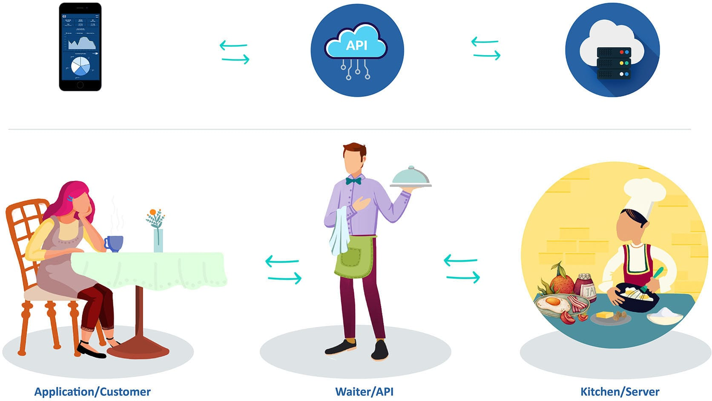
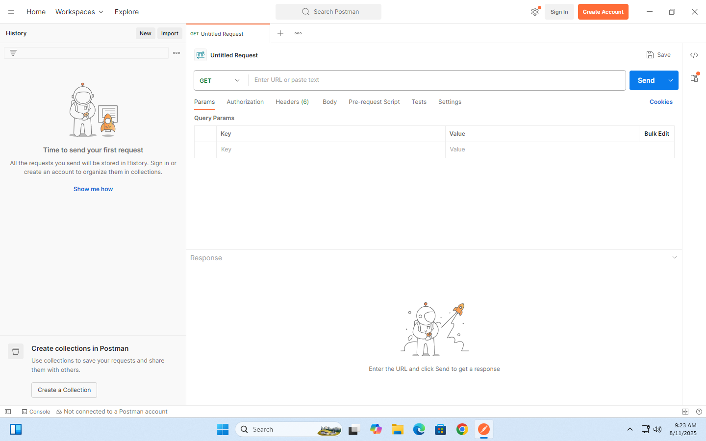

# Modul Ajar: Memahami API untuk Kelas XI SMK PPLG

**Program Keahlian:** Pengembangan Perangkat Lunak dan Gim (PPLG)  
**Tahun Ajaran:** 2025 / 2026  
**Topik:** API (Application Programming Interface)  
**Format:** Bahasa santai tapi formal, mudah dipahami untuk pelajar SMK

---

## API

Di dunia teknologi yang terus berkembang, istilah API sering kali muncul, terutama saat kita berbicara tentang pengembangan aplikasi atau integrasi antar sistem. Namun, apa sebenarnya yang dimaksud dengan API? Mengapa ia begitu penting, dan bagaimana cara kerjanya?

### 1. Pengertian API

API merupakan singkatan dari **Application Programming Interface**, yang dalam bahasa Indonesia berarti _Antarmuka Pemrograman Aplikasi_.  
Secara sederhana, API adalah sebuah **jembatan** yang memungkinkan dua aplikasi berbeda untuk berkomunikasi dan saling bertukar data.

#### Pengertian Menurut Para Ahli

1. **Roy Fielding (Arsitek REST)** 

   > "An API is a set of clearly defined methods of communication among various components."  
   > Artinya, API adalah kumpulan metode yang terdefinisi dengan jelas untuk komunikasi antar komponen. 

2. **James Gosling (Pencipta Java)** 

   > "APIs are the libraries and tools that allow programmers to connect different pieces of software together." 
   > Artinya, API adalah alat dan pustaka yang memungkinkan pengembang menghubungkan berbagai software. 

3. **Grady Booch (Ahli Arsitektur Software)** 

   > "An API represents the contract between different software components."  
   > Artinya, API adalah kesepakatan komunikasi antara dua bagian perangkat lunak. 

4. **IBM Developer** 
   > "An API is a set of rules that define how applications or devices can connect to and communicate with each other."  
   > API adalah seperangkat aturan agar aplikasi bisa terhubung dan berkomunikasi satu sama lain. 

#### Analogi Sederhana

Bayangkan kamu sedang makan di restoran.

- Kamu = **Aplikasi pengguna** (_frontend_)
- Koki = **Server** (_backend_)
- Pelayan = **API** 
  
   
  Pelayan (API) tidak perlu tahu cara memasak, tapi ia tahu bagaimana menyampaikan pesanan dan mengembalikan hasilnya.

---

## Cara Kerja API

API bekerja dengan cara mengirim **permintaan (request)** dan menerima **balasan (response)**.  
Ketika suatu aplikasi membutuhkan data dari aplikasi lain, ia akan memanggil API, lalu API akan:

1. Menerima permintaan (biasanya lewat internet)
2. Mencari data yang diminta di server
3. Mengembalikan data ke aplikasi peminta

Biasanya data dikirim dalam format **JSON** atau **XML**.

### Manfaat API

- **Integrasi sistem**: Menghubungkan aplikasi satu dengan yang lain.
- **Efisiensi waktu**: Tidak perlu membangun semuanya dari nol.
- **Keamanan data**: Bisa membatasi data yang diakses.
- **Pengembangan cepat**: Menyediakan fungsi siap pakai.

### Contoh API di Kehidupan Sehari-hari

- **Google Maps API**: Menampilkan peta pada aplikasi ojek online.
- **Payment Gateway API**: Memproses pembayaran di toko online.
- **Weather API**: Menampilkan suhu dan prakiraan cuaca.

### Istilah Penting dalam API

- **Endpoint**: URL tujuan API yang akan dipanggil.
- **Method**: Jenis permintaan (GET, POST, PUT, DELETE).
- **Response Code**: Kode status hasil eksekusi API.
  - 200 OK → Berhasil
  - 404 Not Found → Tidak ditemukan
  - 500 Internal Server Error → Error di server

---

## Pengenalan Postman

**Postman** adalah aplikasi populer untuk menguji dan mengembangkan API.  
Dengan Postman, kita bisa mengirim request dan melihat response tanpa menulis kode.

### Fungsi Utama Postman

1. Mengirim berbagai jenis request HTTP (GET, POST, PUT, DELETE)
2. Mengatur parameter, header, dan body
3. Menyimpan koleksi API untuk pengujian berulang
4. Melihat detail respons (status code, waktu, data)
5. Mengotomatisasi pengujian API

---

## Cara Kerja dan Komponen Postman

Postman mengirim request HTTP ke endpoint API dan menampilkan response.

**Komponen Utama:**

- **Workspace**: Area kerja untuk mengatur proyek.
- **Collection**: Kumpulan request.
- **Environment**: Variabel yang digunakan di banyak request.
- **Request**: Permintaan tunggal.
- **Response**: Balasan API. 
   

**Langkah Dasar Menggunakan Postman:**

1. Buka Postman dan buat request baru
2. Pilih method (GET, POST, dll.)
3. Masukkan URL endpoint API
4. Atur parameter, header, atau body jika perlu
5. Klik **Send**
6. Lihat response

---

## Istilah Penting di Postman

- **Method**: Jenis permintaan HTTP
- **Endpoint**: URL tujuan API
- **Params**: Parameter query di URL
- **Headers**: Metadata request
- **Body**: Data yang dikirim pada POST/PUT
- **Response Code**: Kode status

**Header Penting:**

- Content-Type: application/json
- Accept: application/json
- Authorization: Bearer `<token>`
- Cache-Control: no-cache

**Jenis Parameter:**

- Path Parameter → `/users/{id}`
- Query Parameter → `?page=2&limit=10`
- Header Parameter → `X-Api-Key`
- Body Parameter → Data di request body

**Jenis Body:**

- application/json
- application/x-www-form-urlencoded
- multipart/form-data
- binary

---

## Troubleshooting

Tidak selamanya request yang dikirim menghasilkan response yang sesuai dengan keinginan, ada kalanya kita menemukan error. Berikut Error beserta kode errornya dan alasan kenapa error tersebut muncul:

- **401 Unauthorized** → Token salah/kadaluarsa 
  Pastikan apakah endpoint memang butuh autentikasi? Beberapa mungkin publik, tapi sebagian besar butuh token. Pastikan juga token sudah dikirimkan di header   
- **404 Not Found** → URL atau parameter salah 
  Cek apakah endpoint URL sudah benar? Salah ketik satu huruf saja bisa membuat error 404 muncul.   

- **400 / 422 Validation Error** → Data tidak sesuai format 
  Pastikan semua field wajib sudah diisi dan tipe datanya sesuai   

- **500 Internal Server Error** → Error di server 
  Jika kamu tidak punya akses ke server, laporkan ke tim backend dengan payload dan endpoint yang kamu pakai. 

---

## Latihan

1. GET list siswa dari `https://marhaspplg.my.id/api/siswa`
2. GET single siswa dengan path param
3. POST create siswa dengan body JSON
4. PUT/PATCH update siswa dengan body JSON
