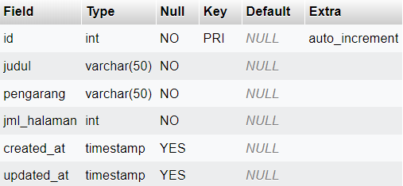
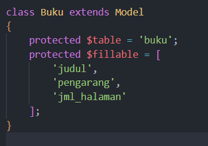
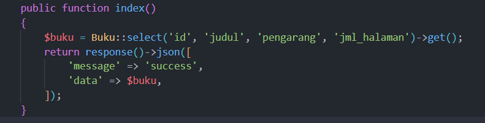
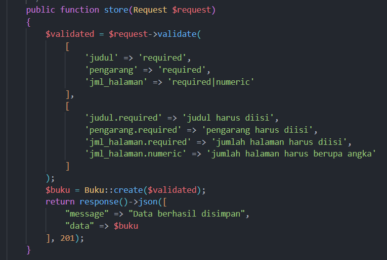
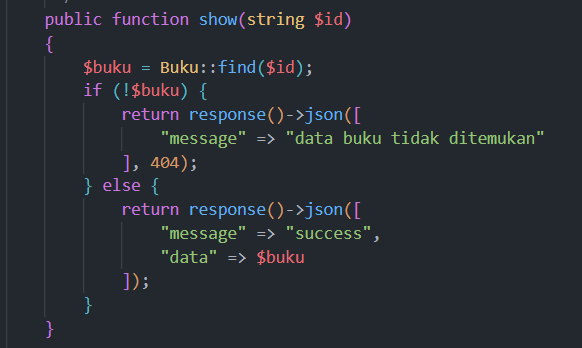
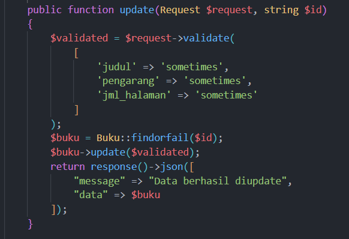
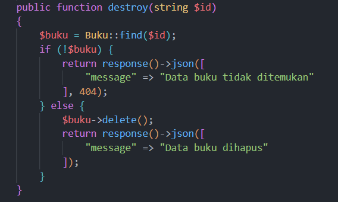
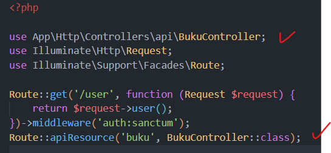
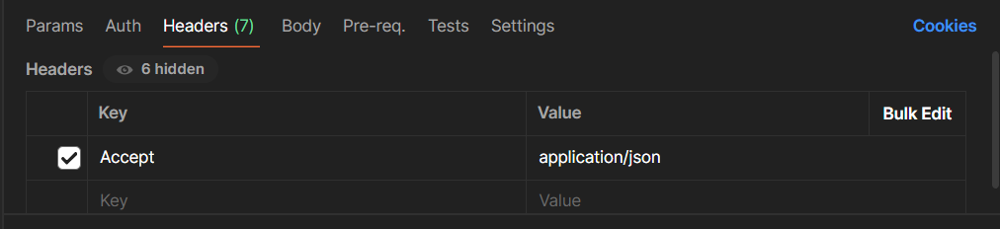

id: restapi-laravel-part2
summary: Belajar Rest API dengan Laravel Part 2
categories: laravel, php, backend
status: Published
authors: Ramdani
Feedback Link: https://github.com/username/repo/issues

## Step1: Membuat table

Setelah setup project Laravel dipastikan selesai, buatlah tabel-tabel yang dibutuhkan di PhpMyAdmin.  
Contohnya dalam studi kasus `db_perpustakaan` kita buat table bernama **buku** sebagai berikut:  
<br>

**Keterangan:**  
Tabel wajib memiliki kolom `id`, `created_at`, dan `updated_at`.

---

## Step2: Membuat Model

Seperti yang sudah dipelajari sebelumnya, untuk memetakan/memodelkan data kita membutuhkan model.  
Untuk membuat model di Laravel cukup menggunakan terminal dan ketikkan:

```bash
php artisan make:model Namamodel
```

> **Penting:** Nama model harus diawali dengan huruf kapital, contoh: `Buku`

Jika berhasil, model yang dibuat akan berada di folder `app/Models`.

Di dalam class isikan kode sebagai berikut:  
<br>

**Keterangan:**

- Bagian `protected $table = 'namatabel';` berfungsi untuk menghubungkan ke tabel dari MySQL.
- Bagian `protected $fillable = ['kolom1', 'kolom2'];` berfungsi untuk mendaftarkan atribut (nama kolom) yang bisa kita isi ketika melakukan insert atau update ke database.  
  Kolom `id`, `created_at`, dan `updated_at` **tidak perlu dimasukkan** karena ketiga kolom tersebut akan terisi otomatis.

---

## Step3: Install API

Untuk menginstall layanan API di Laravel, buka terminal kemudian ketikkan:

```bash
php artisan install:api
```

Tunggu beberapa saat. Jika ada pertanyaan tentang pending migration, ketikkan **no** kemudian tekan **Enter**.

---

## Step4: Membuat Controller

Sebelumnya kita sudah mempelajari service di Vue.js. Di Laravel, **controller** berfungsi kurang lebih sama dengan service.  
Controller berisi logika-logika untuk menyusun suatu fungsi dalam aplikasi, seperti proses **CRUD (Create, Read, Update, Delete)**.

Untuk membuat controller di Laravel, buka terminal kemudian ketik:

```bash
php artisan make:controller api/NamaController --api
```

> **Penting:** Pastikan nama controller diawali dengan huruf kapital dan diakhiri dengan _Controller_, contoh: `BukuController`

Jika berhasil dibuat, controller akan berada di folder `app/Http/Controllers/api`.

---

## Step5: Membuat Operasi CRUD (Create, Read, Update, Delete)

Buka controller yang tadi dibuat, kemudian pada bagian atas tambahkan import model dengan kata kunci `use`:

```php
use App\Models\Namamodel;
```

### 1. Function index



### 2. Function store



### 3. Function show



### 4. Function update



### 5. Function destroy



---

## Step6: Membuat Route

Di Laravel, **route (rute)** adalah mekanisme untuk memetakan URL (alamat web) dengan fungsi atau logika tertentu, seperti menampilkan view, memanggil controller, atau mengembalikan respons API.  
Route berada di folder `routes`.

Karena saat ini kita bertujuan untuk membuat **backend API**, maka yang digunakan adalah file `api.php`.

Lakukan import controller dengan kata kunci `use` di bagian atas file:

```php
use App\Http\Controllers\api\NamaController;
```

Tambahkan kode berikut di bagian bawah file:  


---

## Step7: Mengetes Aplikasi

1. Jalankan server Laravel dengan perintah:

```bash
php artisan serve
```

2. Buka **Postman** kemudian isikan header sebagai berikut:  
   

3. Masukkan URL berikut dan uji satu per satu menggunakan method **GET**, **POST**, **PUT/PATCH**, dan **DELETE**:

```
localhost:8000/api/buku
```
