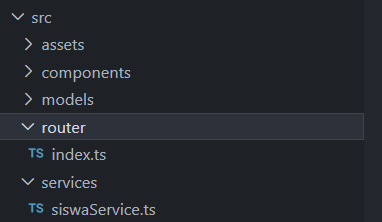

summary: Membuat fungsi POST untuk menyimpan data siswa menggunakan Vue 3 + TypeScript
id: vue-post-siswa
categories: vue, typescript, crud
tags: vue, typescript, crud, api
status: Published
authors: Ramdani
feedback link: https://github.com/

# Vue 3 - Menyimpan Data dengan Method POST

## Step 1 - Persiapan

Setelah sebelumnya kita berhasil membuat fungsi untuk menampilkan data dari API siswa lewat **GET**, sekarang kita akan melanjutkan progress untuk membuat fungsi menyimpan data lewat method **POST**.  

Adapun persiapan yang harus dilakukan di antaranya:

1. **Buka project di VS Code lewat CMD**  
   Apabila sebelumnya project di-close, buka kembali folder project lewat CMD (pastikan membuka jendela CMD di dalam folder project, bukan di luar).

2. **Install router**  
   Pada jendela CMD ketik perintah berikut:
   ```bash
   npm install vue-router@latest
   ```

3. **Reload jendela di VS Code**  
   Tekan `Ctrl+Shift+P`, kemudian ketik `Reload Window`, lalu tekan `Enter`.

## Step 2 - Mengupdate Service

Buka file **siswaService.ts**, lalu ketikkan kode berikut di bawah kurung kurawal penutup function `getAllSiswa()`:

```ts
// Fungsi untuk menyimpan siswa baru
export async function storeSiswa(payload: Omit<Siswa, "id">): Promise<Siswa> {
  const res = await fetch(API_URL, {
    method: "POST",
    headers: {
      "Content-Type": "application/json",
    },
    body: JSON.stringify(payload),
  });

  if (!res.ok) {
    throw new Error("Gagal menyimpan data siswa");
  }

  const body = await res.json();
  return body.data;
}
```

## Step 3 - Membuat View dan Router

Buat folder baru di dalam folder **src** bernama `router` dan buat file baru bernama **CreateSiswa.vue** di dalam folder `src/views`.
<br>

<br>

### File `router/index.ts`
```ts
import { createRouter, createWebHistory } from "vue-router";
import HomeView from "../views/HomeView.vue";
import CreateSiswa from "../views/CreateSiswa.vue";

const routes = [
  { path: "/", name: "Home", component: HomeView },
  { path: "/create", name: "CreateSiswa", component: CreateSiswa },
];

const router = createRouter({
  history: createWebHistory(),
  routes,
});

export default router;
```

### File `views/CreateSiswa.vue`

```vue
<script setup lang="ts">
import { ref } from "vue";
import { useRouter } from "vue-router";
import { storeSiswa } from "../services/siswaService";

const router = useRouter();

const nama = ref("");
const kelas = ref("");
const jenis_kelamin = ref("");
const alamat = ref("");

const errors = ref<{ [key: string]: string }>({});

function validateForm() {
  errors.value = {};

  if (!nama.value) errors.value.nama = "Nama wajib diisi";
  if (!kelas.value) errors.value.kelas = "Kelas wajib diisi";
  if (!jenis_kelamin.value) errors.value.jenisKelamin = "Pilih jenis kelamin";
  if (!alamat.value) errors.value.alamat = "Alamat wajib diisi";

  return Object.keys(errors.value).length === 0;
}

async function submitForm() {
  if (validateForm()) {
    await storeSiswa({
      nama: nama.value,
      kelas: kelas.value,
      jenis_kelamin: jenis_kelamin.value,
      alamat: alamat.value,
    });

    router.push("/");
  }
}
</script>

<template>
  <h1>Tambah Siswa</h1>
  <div class="form-container">
    <form @submit.prevent="submitForm">
      <label for="nama">Nama</label>
      <input id="nama" v-model="nama" type="text" />
      <small v-if="errors.nama" style="color: red">{{ errors.nama }}</small><br />

      <label for="kelas">Kelas</label>
      <input id="kelas" v-model="kelas" type="text" />
      <small v-if="errors.kelas" style="color: red">{{ errors.kelas }}</small><br />

      <label for="jenisKelamin">Jenis Kelamin</label>
      <select id="jenisKelamin" v-model="jenis_kelamin">
        <option value="">Pilih</option>
        <option value="Laki-Laki">Laki-Laki</option>
        <option value="Perempuan">Perempuan</option>
      </select>
      <small v-if="errors.jenisKelamin" style="color: red">{{ errors.jenisKelamin }}</small><br />

      <label for="alamat">Alamat</label>
      <textarea id="alamat" v-model="alamat"></textarea>
      <small v-if="errors.alamat" style="color: red">{{ errors.alamat }}</small><br />

      <button type="submit">Simpan</button>
    </form>
  </div>
</template>
```

## Step 4 - Mendaftarkan Router

Edit file **main.ts** menjadi sebagai berikut:

```ts
import { createApp } from "vue";
import "./style.css";
import App from "./App.vue";
import router from "./router";

createApp(App)
  .use(router)
  .mount("#app");
```

## Step 5 - Membuat Halaman Menjadi Dinamis

Edit isi file **App.vue** menjadi:

```vue
<template>
  <router-view />
</template>
```

## Step 6 - Test Aplikasi

Untuk mengetes aplikasi jalankan melalui CMD dengan perintah:

```bash
npm run dev
```

Kemudian pada address bar tambahkan `/create` untuk mengakses halaman tambah siswa.

## Step 7 - Membuat Navigasi

Untuk memudahkan akses, tambahkan kode berikut pada file **HomeView.vue** di bawah tag `<h1>`:

```vue
<router-link :to="{ name: 'CreateSiswa' }">Tambah</router-link>
```

## Styling Tambahan (Opsional)

Untuk membuat halaman menjadi lebih menarik, silakan tambahkan styling pada file **style.css**:

```css
.form-container {
  max-width: 400px;
  margin: 20px auto;
  padding: 16px;
  border: 1px solid #ddd;
  border-radius: 6px;
  background: #f9f9f9;
  text-align: left;
}

.form-group {
  margin-bottom: 12px;
}

label {
  font-weight: bold;
}

input,
select,
textarea {
  width: 100%;
  padding: 8px;
  border: 1px solid #bbb;
  border-radius: 4px;
  font-size: 14px;
  font-family: inherit;
  box-sizing: border-box;
}

textarea {
  resize: vertical;
  min-height: 60px;
}

.form-actions {
  display: flex;
  justify-content: space-between;
  align-items: center;
}

.btn-secondary {
  display: inline-block;
  padding: 0.6em 1.2em;
  border-radius: 8px;
  font-size: 1em;
  font-weight: 500;
  font-family: inherit;
  text-decoration: none;
  background: #6c757d;
  color: white;
  cursor: pointer;
  transition: background 0.25s;
}

.btn-secondary:hover {
  background: #565e64;
}
```
