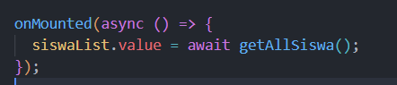

id: vuejs-update-delete
summary: Membuat fungsi Update dan Delete di Vue.js
categories: vue, typescript, frontend
status: Published
authors: Ramdani
Feedback Link: https://github.com/username/repo/issues

# Membuat Fungsi Update dan Delete di Vue.js

Panduan ini menjelaskan langkah demi langkah cara menambahkan fitur **update** dan **delete** data pada aplikasi Vue.js.

## Step 1 — Membuat Fungsi Update

Setelah sebelumnya selesai membuat fungsi tambah, kali ini kita akan membuat fungsi untuk mengupdate dan menghapus data. Pertama-tama kita akan fokus dengan fungsi **update** terlebih dahulu.

Buka file `siswaService.ts` kemudian tambahkan code berikut di bawah kurung kurawal penutup `storeSiswa`:

```ts
export async function getSiswaById(id: number): Promise<Siswa | undefined> {
  const res = await fetch(`${API_URL}/${id}`);
  const body = await res.json();
  console.log("getSiswaById response:", body);
  return body as Siswa;
}

export async function updateSiswa(
  id: number,
  payload: Omit<Siswa, "id">
): Promise<Siswa> {
  const res = await fetch(`${API_URL}/${id}`, {
    method: "PUT",
    headers: {
      "Content-Type": "application/json",
    },
    body: JSON.stringify(payload),
  });

  if (!res.ok) {
    throw new Error("Gagal mengupdate data siswa");
  }

  const body = await res.json();
  return body.data;
}
```

---

## Step 2 — Membuat View EditSiswa

Di dalam folder `views` buat file baru bernama `EditSiswa.vue` kemudian ketikkan code berikut:

```vue
<script setup lang="ts">
import { ref, onMounted } from "vue";
import { useRouter, useRoute } from "vue-router";
import { getSiswaById, updateSiswa } from "../services/siswaService";

const router = useRouter();
const route = useRoute();

const nama = ref("");
const kelas = ref("");
const jenis_kelamin = ref("");
const alamat = ref("");

const errors = ref<{ [key: string]: string }>({});

const id = Number(route.params.id);

function validateForm() {
  errors.value = {};

  if (!nama.value) errors.value.nama = "Nama wajib diisi";
  if (!kelas.value) errors.value.kelas = "Kelas wajib diisi";
  if (!jenis_kelamin.value) errors.value.jenisKelamin = "Pilih jenis kelamin";
  if (!alamat.value) errors.value.alamat = "Alamat wajib diisi";

  return Object.keys(errors.value).length === 0;
}

async function submitForm() {
  if (validateForm()) {
    await updateSiswa(id, {
      nama: nama.value,
      kelas: kelas.value,
      jenis_kelamin: jenis_kelamin.value,
      alamat: alamat.value,
    });
    router.push("/");
  }
}

onMounted(async () => {
  const siswa = await getSiswaById(id);
  console.log("Fetched siswa:", siswa); // Debug line
  if (siswa) {
    nama.value = siswa.nama ?? "";
    kelas.value = siswa.kelas ?? "";
    jenis_kelamin.value = siswa.jenis_kelamin ?? "";
    alamat.value = siswa.alamat ?? "";
  }
});
</script>

<template>
  <h1>Edit Siswa</h1>
  <div class="form-container">
    <form @submit.prevent="submitForm">
      <label for="nama">Nama</label>
      <input id="nama" v-model="nama" type="text" />
      <small v-if="errors.nama" style="color: red">{{ errors.nama }}</small
      ><br />

      <label for="kelas">Kelas</label>
      <input id="kelas" v-model="kelas" type="text" />
      <small v-if="errors.kelas" style="color: red">{{ errors.kelas }}</small
      ><br />

      <label for="jenisKelamin">Jenis Kelamin</label>
      <select id="jenisKelamin" v-model="jenis_kelamin">
        <option value="">Pilih</option>
        <option value="Laki-Laki">Laki-Laki</option>
        <option value="Perempuan">Perempuan</option>
      </select>
      <small v-if="errors.jenisKelamin" style="color: red">{{
        errors.jenisKelamin
      }}</small
      ><br />

      <label for="alamat">Alamat</label>
      <textarea id="alamat" v-model="alamat"></textarea>
      <small v-if="errors.alamat" style="color: red">{{ errors.alamat }}</small
      ><br />

      <button type="submit">Simpan Perubahan</button>
    </form>
  </div>
</template>
```

---

## Step 3 — Mendaftarkan Route

Buka file `router/index.ts` kemudian tambahkan import:

```ts
import EditSiswa from "../views/EditSiswa.vue";
```

Tambahkan route berikut:

```ts
{ path: "/edit/:id", name: "EditSiswa", component: EditSiswa },
```

---

## Step 4 — Membuat Tombol Edit

Di dalam `HomeView.vue` tambahkan import:

```ts
import router from "../router";
```

Kemudian tambahkan code berikut di bawah tag P alamat:

```vue
<div class="actions">
  <button class="btn btn-yellow" @click="router.push(`/edit/${siswa.id}`)">Edit</button>
</div>
```

Tambahkan style di bagian paling bawah file:

```vue
<style scoped>
.actions {
  margin-top: 1rem;
  display: flex;
  gap: 0.5rem;
}

.btn {
  padding: 0.4rem 0.8rem;
  border: none;
  border-radius: 4px;
  cursor: pointer;
  font-size: 0.9rem;
}

.btn-green {
  background: #4caf50;
  color: white;
}

.btn-yellow {
  background: #fbc02d;
  color: black;
}

.btn-red {
  background: #e53935;
  color: white;
}
</style>
```

Setelah itu jalankan aplikasi untuk mengetes.

---

## Step 5 — Membuat Fungsi Hapus

Setelah berhasil membuat edit, sekarang kita akan membuat fungsi hapus.  
Buka file `siswaService.ts` kemudian tambahkan code berikut di bawah kurung kurawal penutup `updateSiswa`:

```ts
export async function deleteSiswa(id: number): Promise<void> {
  const res = await fetch(`${API_URL}/${id}`, {
    method: "DELETE",
  });

  if (!res.ok) {
    throw new Error("Gagal menghapus data siswa");
  }
}
```

---

## Step 6 — Membuat Tombol Hapus

1. Buka file `HomeView.vue`.
2. Ubah pada bagian import menjadi:

```ts
import { getAllSiswa, deleteSiswa } from "../services/siswaService";
```

3. Ubah juga bagian ini: <br>
   <br><br>
   menjadi:<br>

```ts
async function loadData() {
  siswaList.value = await getAllSiswa();
}

onMounted(loadData);

async function handleDelete(id: number) {
  if (confirm("Yakin ingin menghapus siswa ini?")) {
    await deleteSiswa(id);
    await loadData();
  }
}
```

4. Terakhir, tambahkan button hapus di bawah button edit:

```vue
<button class="btn btn-red" @click="handleDelete(siswa.id)">Hapus</button>
```

---

Sekarang jalankan aplikasi untuk mengetes hasilnya.
